# BAB IV

# HASIL DAN PEMBAHASAN

## 4.1 Spesifikasi Sistem

Implementasi CitraFrame dilakukan pada lingkungan pengujian beta berbasis *website*. Sistem terdiri atas antarmuka pelanggan, antarmuka admin, layanan *backend* berbasis Golang, basis data MySQL Aiven, penyimpanan media Cloudinary, autentikasi Firebase, integrasi ongkos kirim API.co.id, dan pembayaran Flip. Bukti visual pada Bab IV menggunakan data katalog nyata non-PII yang tersedia pada aplikasi beta, seperti produk Arcalod Gold, Arcalod Silver, Araclodd, serta *art print* Golden Eagle Sovereign. Skenario otomatis yang perlu membuat, memperbarui, dan menghapus record tetap memakai data uji terkontrol sementara agar tidak mengganggu data katalog aplikasi.

Tabel 4.1 menunjukkan perangkat keras yang digunakan untuk pengujian otomatis. Pengujian kamera dan *markerless Augmented Reality* pada perangkat fisik belum dilakukan sehingga masih ditandai sebagai memerlukan *smartphone*.

**Tabel 4.1 Spesifikasi Perangkat Keras**

| No | Komponen | Spesifikasi | Fungsi |
|---|---|---|---|
| 1 | Perangkat pengembangan dan pengujian otomatis | macOS 26.4.1, Apple M1, RAM 8 GB, arsitektur arm64 | Menjalankan *backend*, *static server frontend*, unit test, integration test, dan pembuatan dokumen |
| 2 | Perangkat uji *smartphone* | Belum diuji pada sesi otomatis | Diperlukan untuk pengujian kamera, WebXR, dan penempatan objek 3D pada dinding |
| 3 | Browser otomatis | Google Chrome lokal dan Playwright MCP saat tersedia, viewport 1440x900 | Screenshot desktop, inspeksi *console*, dan inspeksi *network* secara visual |

**Tabel 4.2 Spesifikasi Perangkat Lunak**

| No | Kategori | Teknologi | Fungsi |
|---|---|---|---|
| 1 | *Frontend* | HTML, CSS, JavaScript statis | Antarmuka pelanggan dan admin |
| 2 | *Backend/API* | Golang 1.25.1, Gorilla Mux | Logika bisnis, validasi, otorisasi, dan REST API |
| 3 | Basis data | MySQL Aiven beta | Penyimpanan produk, *art print*, alamat, keranjang, pesanan, item pesanan, slider, dan pesanan kustom |
| 4 | AR/3D | WebXR, Three.js, aset GLB | Visualisasi bingkai dalam mode AR berbasis browser |
| 5 | Autentikasi | Firebase Authentication dan JWT admin | Autentikasi pelanggan dan otorisasi admin |
| 6 | Layanan eksternal | Cloudinary, API.co.id, Flip *sandbox* | Penyimpanan media, ongkos kirim, dan pembayaran uji |
| 7 | Alat pengujian | Go test, Go build, Node.js 24.9.0, Pandoc 3.8.1 | Pengujian otomatis, validasi JavaScript, dan pembuatan dokumen |

Versi kode yang diuji berada pada commit lokal `53376cc`. Sistem *frontend* tidak memiliki `package.json`, sehingga tahap *frontend build* tidak berlaku. Sebagai gantinya, semua berkas JavaScript pada direktori `frontend` divalidasi menggunakan `node --check`.

## 4.2 Gambaran Umum Hasil Penelitian

Hasil penelitian berupa sistem CitraFrame berbasis *website* yang mendukung katalog produk bingkai, katalog *art print*, *custom frame builder*, keranjang belanja, alamat pelanggan, *checkout*, invoice, dashboard admin, CRUD produk, CRUD *art print*, CRUD slider, manajemen pesanan, serta halaman WebAR. Sistem dikembangkan untuk menjawab kebutuhan Citra Art Frame dalam memberikan visualisasi produk yang lebih realistis dibanding katalog dua dimensi.

Berdasarkan pengujian otomatis pada lingkungan beta, fungsi inti sistem telah berjalan pada sisi *backend*, basis data, integrasi pembayaran *sandbox*, integrasi Cloudinary, integrasi API.co.id, serta sebagian besar endpoint HTTP lokal. Perbaikan keamanan yang sebelumnya menjadi prioritas juga telah diverifikasi, yaitu proteksi `/api/admin/stats`, proteksi detail order pelanggan, respons JSON 401/403 pada API tanpa *redirect* 302, validasi *checkout*, perhitungan ulang harga di *backend*, penanganan kegagalan Flip, dan perbaikan referensi aset placeholder.

Bagian yang belum dapat dinyatakan selesai adalah pengujian kamera WebAR pada *smartphone*, pengukuran performa, dan pengujian *usability* menggunakan SUS. Screenshot otomatis, inspeksi *console*, dan inspeksi *network* desktop telah dilakukan menggunakan browser desktop otomatis. Status yang masih belum final tidak dianggap gagal karena membutuhkan perangkat fisik, alat ukur performa tambahan, atau responden.

## 4.3 Hasil Implementasi Sistem

### 4.3.1 Implementasi Antarmuka Publik

Antarmuka publik terdiri atas halaman beranda, katalog produk, katalog *art print*, detail produk, *custom frame builder*, halaman AR, keranjang, halaman alamat, *checkout*, dan invoice. Pengujian HTTP lokal menunjukkan halaman publik utama dapat diakses dengan status 200. Aset JavaScript, CSS, dan model `frame.glb` juga berhasil dimuat melalui *static server* lokal. Pada bukti visual, katalog produk menampilkan data beta nyata seperti Arcalod Gold, Arcalod Silver, dan Araclodd, sedangkan katalog *art print* menampilkan Golden Eagle Sovereign, Golden Bull Power, Black Panther Royale, dan Violet Run of Freedom.

**Tabel 4.3 Ringkasan Implementasi Antarmuka Publik**

| Modul | Hasil implementasi | Hasil uji aktual | Status |
|---|---|---|---|
| Homepage | Menampilkan halaman awal CitraFrame | `GET /` menghasilkan 200 | PASS |
| Katalog produk | Menampilkan daftar produk dari basis data | `GET /products` menghasilkan 200 | PASS |
| Art print | Menampilkan katalog *art print* | `GET /prints` menghasilkan 200 | PASS |
| Detail produk | Menampilkan halaman detail | `GET /print-detail` menghasilkan 200 | PASS |
| Custom frame builder | Menyediakan pilihan bingkai, ukuran, matboard, dan perhitungan harga | Halaman dapat diakses dan bukti visual dibuat | PASS |
| Halaman AR | Menyediakan mode visualisasi AR | Halaman dan `frame.glb` dapat diakses | PASS untuk akses HTTP dan aset GLB |

**Gambar 4.1 Halaman Beranda CitraFrame**

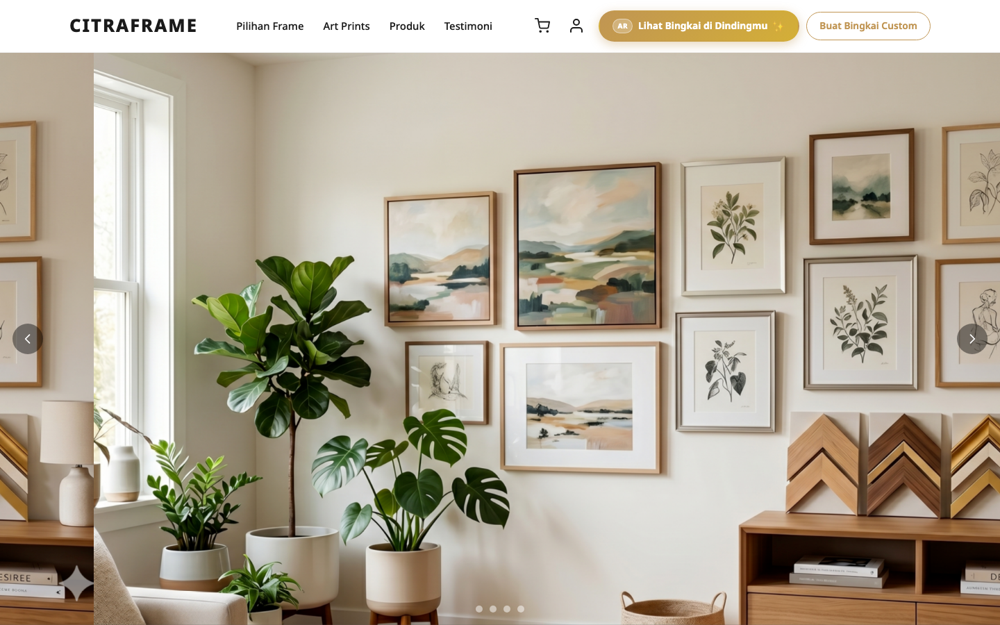{height=7.0in}

**Gambar 4.2 Halaman Katalog Produk**

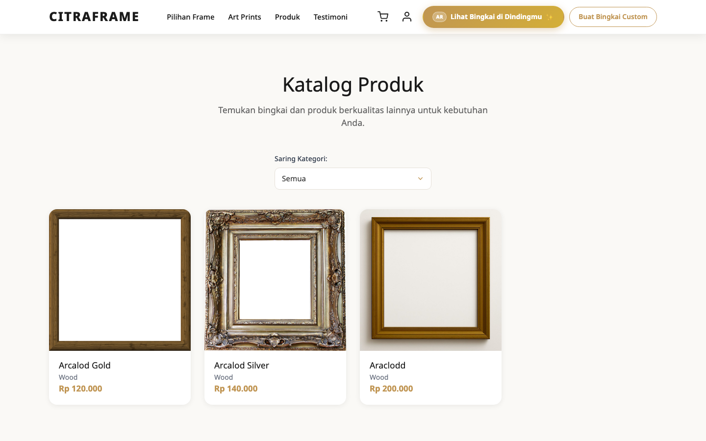{width=6.0in}

**Gambar 4.3 Halaman Katalog Art Print**

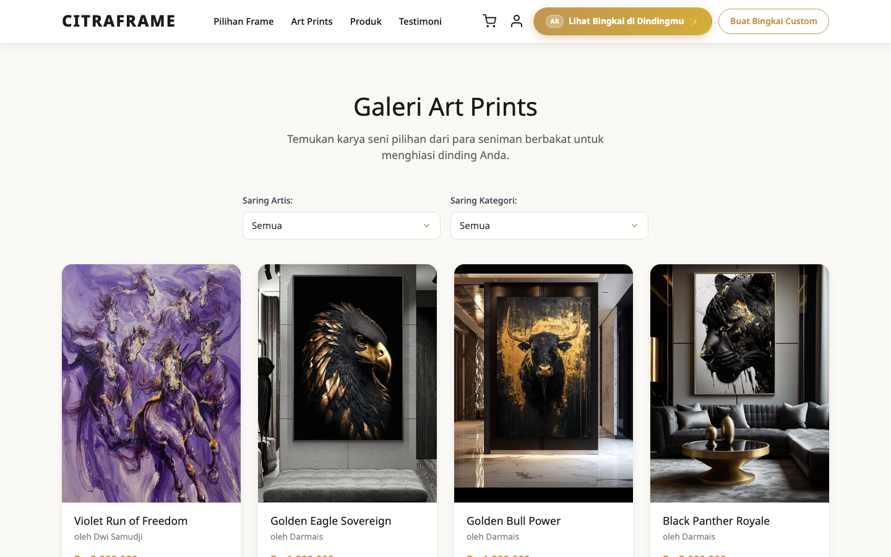{width=6.0in}

**Gambar 4.4 Halaman Detail Produk**

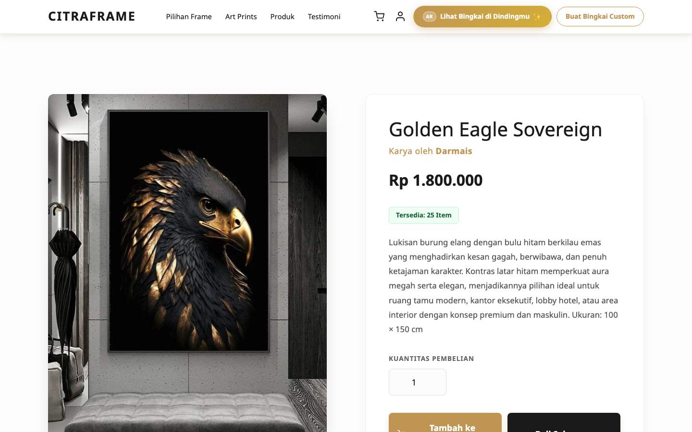{width=6.0in}

**Gambar 4.5 Halaman Custom Frame Builder**

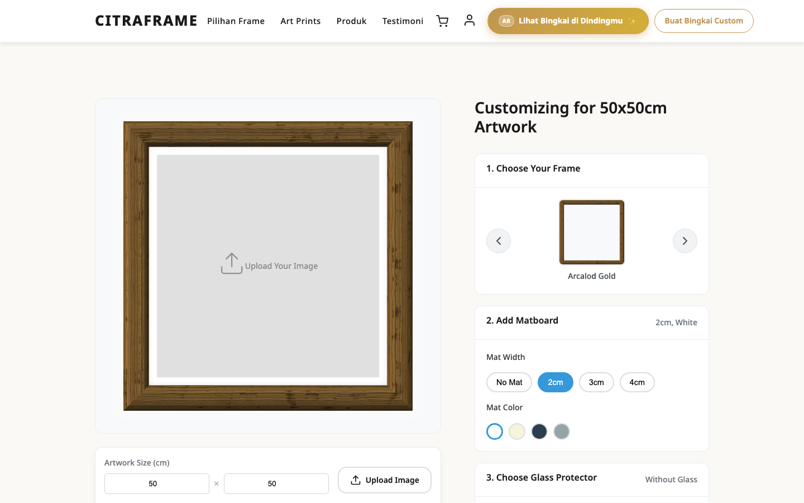{width=6.0in}

**Gambar 4.6 Halaman Keranjang**

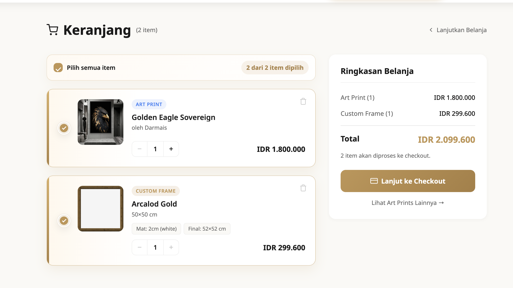{width=6.0in}

**Gambar 4.7 Halaman Alamat**

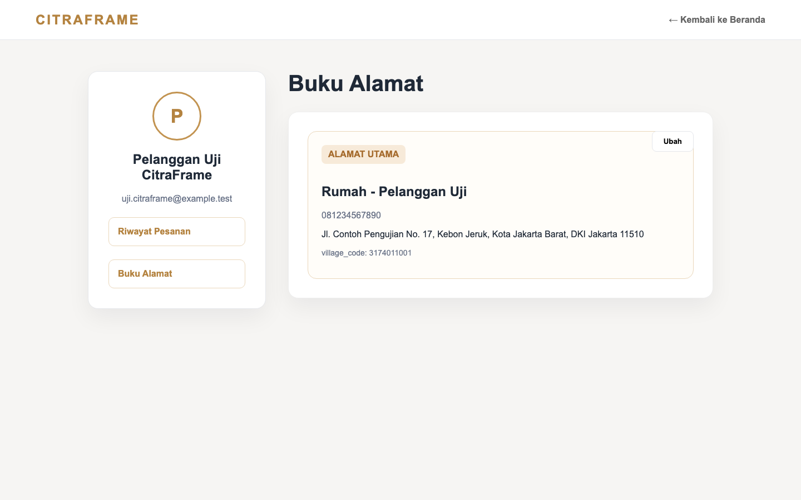{width=6.0in}

**Gambar 4.8 Halaman Checkout**

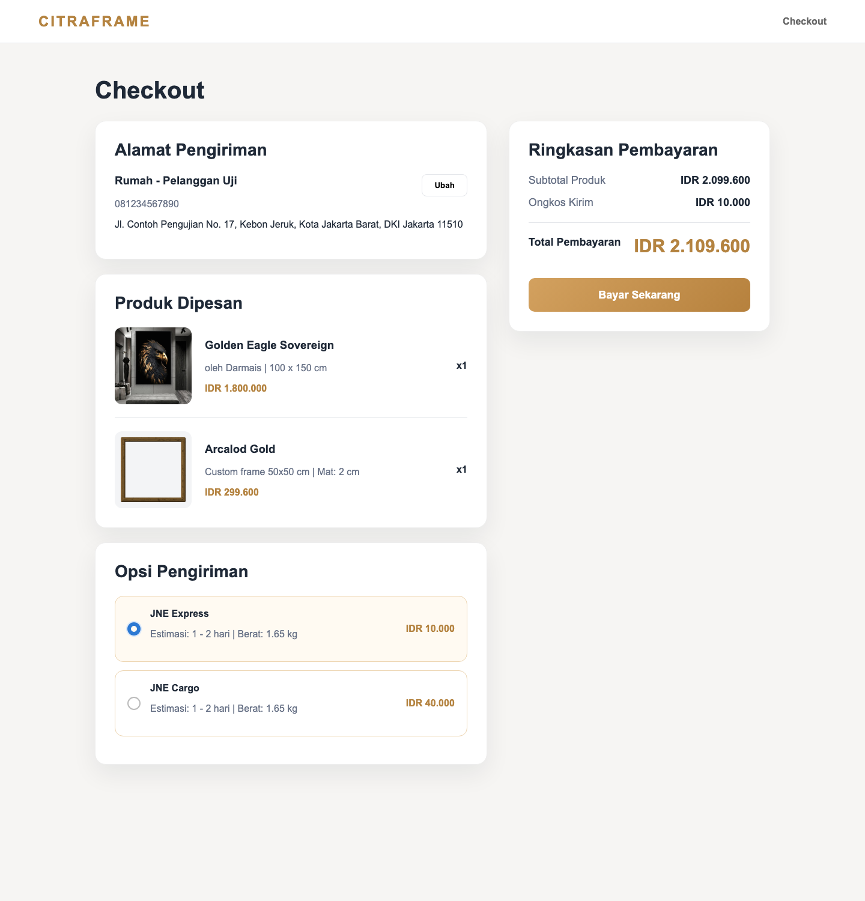{height=7.0in}

**Gambar 4.9 Validasi Checkout**

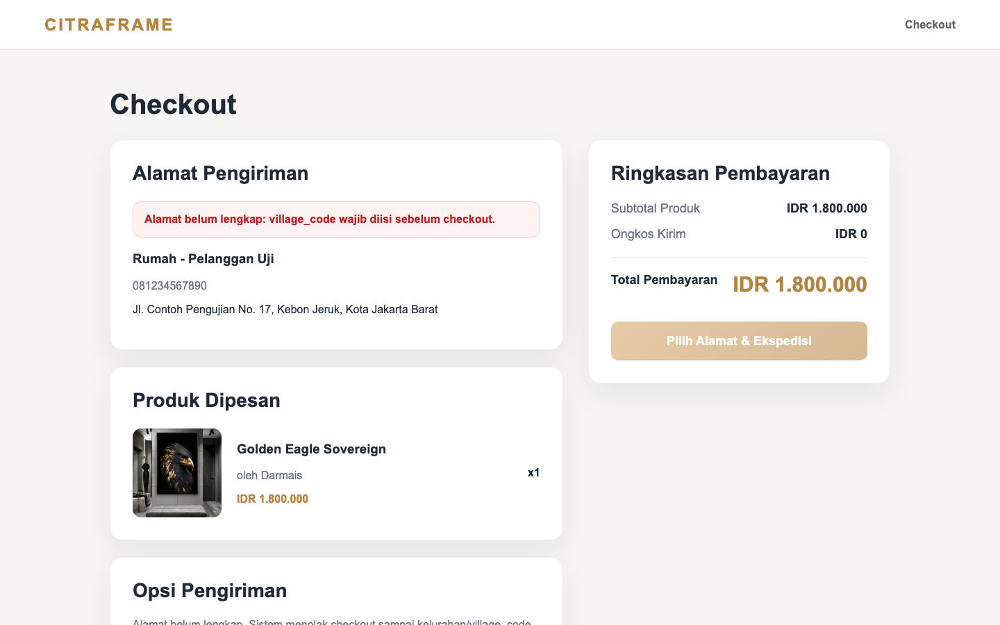{width=6.0in}

**Gambar 4.10 Pembayaran Flip Sandbox**

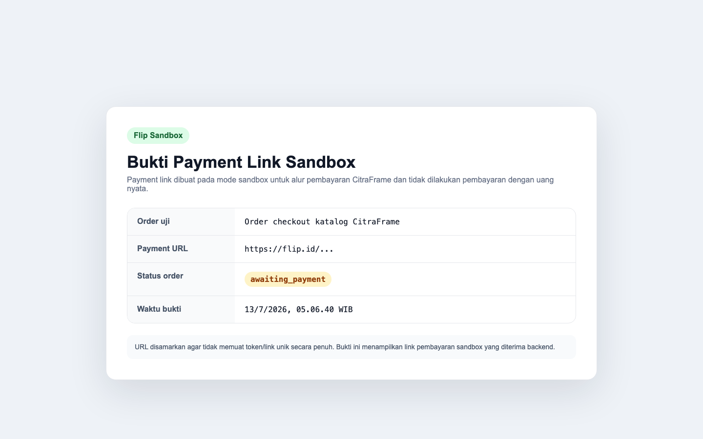{width=6.0in}

**Gambar 4.11 Halaman Invoice**

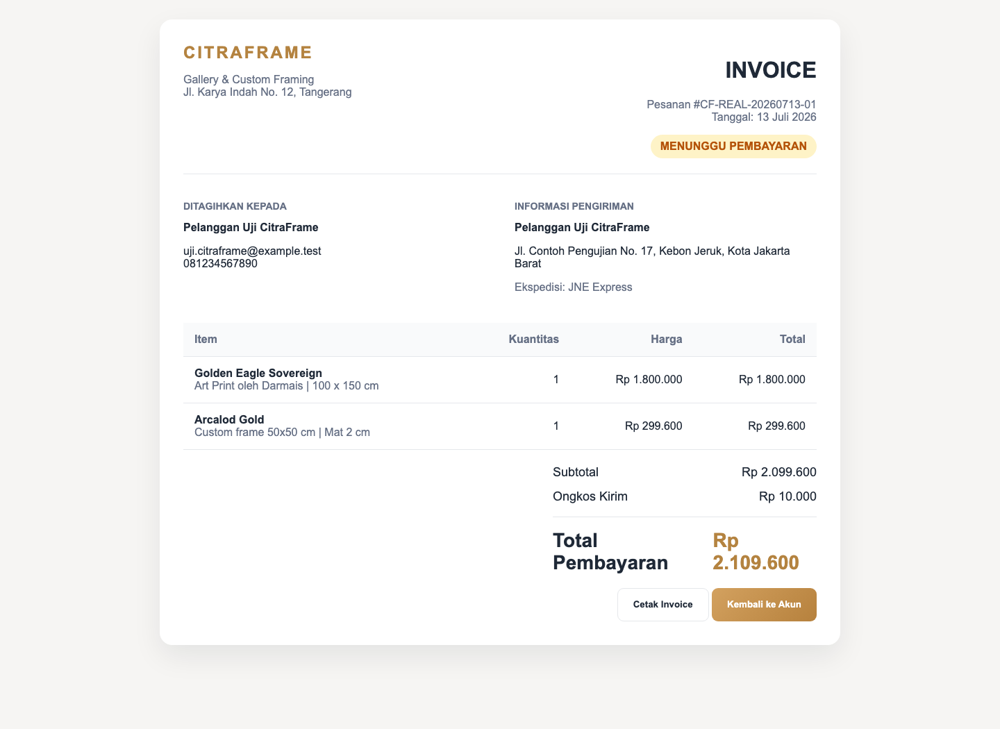{width=6.0in}

**Gambar 4.12 Pemilihan Mode AR**

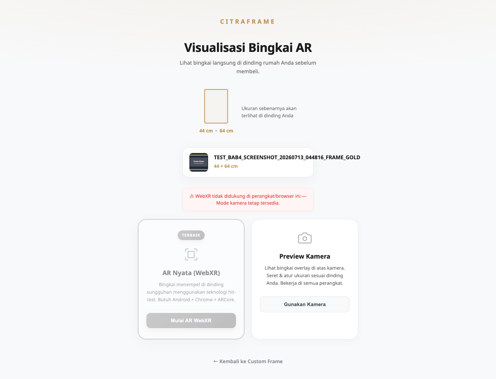{width=6.0in}

### 4.3.2 Implementasi Autentikasi dan Otorisasi

Autentikasi pelanggan menggunakan Firebase, sedangkan admin menggunakan JWT. Middleware JWT untuk endpoint API telah disesuaikan agar mengembalikan respons JSON dengan status 401 atau 403, bukan *redirect* 302. Endpoint `/api/admin/stats` dipindahkan ke grup route yang membutuhkan JWT admin.

Detail pesanan pada `/api/orders/{id}` dilindungi oleh middleware pelanggan atau admin. Pelanggan Firebase hanya dapat membaca pesanannya sendiri. Pengguna tanpa autentikasi menerima 401. Pengguna yang tidak berhak menerima 403 dengan pesan generik sehingga respons tidak membocorkan keberadaan pesanan milik pengguna lain. Admin dapat membaca detail pesanan sesuai otorisasi admin.

**Tabel 4.4 Ringkasan Pengujian Otorisasi**

| Skenario | Hasil diharapkan | Hasil aktual | Status |
|---|---|---|---|
| `/api/admin/stats` tanpa JWT | 401 JSON | 401, tanpa `Location` header | PASS |
| `/api/orders/{id}` tanpa autentikasi | 401 JSON | 401, tanpa *redirect* | PASS |
| Pemilik membaca order sendiri | 200 | 200 | PASS |
| User lain membaca order | 403 generik | 403 | PASS |
| Admin membaca order | 200 | 200 | PASS |
| JWT invalid | 401 JSON | 401, tanpa *redirect* | PASS |

### 4.3.3 Implementasi Checkout dan Pembayaran

Logika *checkout* diperkuat dengan validasi *backend*. Validasi mencakup item tidak boleh kosong, nama pelanggan wajib dan panjangnya valid, email wajib dan harus sesuai format, nomor telepon wajib dan harus sesuai format, alamat dan `village_code` wajib, pilihan pengiriman wajib, jumlah item harus lebih dari nol, produk harus ditemukan, serta stok harus tersedia.

Sistem tidak lagi mempercayai harga, subtotal, ongkos kirim, atau total dari *frontend*. Harga produk diambil dari basis data, ongkos kirim diambil dari layanan *backend*, subtotal dihitung dari harga basis data dikalikan jumlah item, dan total dihitung ulang di *backend*. Pada data katalog beta, Arcalod Gold tercatat dengan harga Rp120.000, Arcalod Silver Rp140.000, dan Golden Eagle Sovereign Rp1.800.000. Pengujian manipulasi harga tetap dilakukan dengan payload uji terkontrol; hasilnya membuktikan nilai akhir diambil dari basis data dan ongkir server, bukan dari nilai yang dikirim frontend.

Alur pembayaran dibuat sebagai berikut. Order dibuat dengan status `pending_payment`, stok ditangani secara konsisten, kemudian *backend* memanggil Flip *sandbox*. Jika Flip berhasil, sistem menyimpan *payment URL* dan mengubah status menjadi `awaiting_payment`. Jika Flip gagal, sistem menandai order sebagai `payment_failed` dan mengembalikan stok melalui transaksi kompensasi. Pengujian memastikan tidak ada order yang ditinggalkan dalam status berhasil tanpa *payment link*.

**Tabel 4.5 Ringkasan Pengujian Checkout**

| Skenario | Hasil diharapkan | Hasil aktual | Status |
|---|---|---|---|
| Item kosong | Ditolak | 400 | PASS |
| Email tidak valid | Ditolak | 400 | PASS |
| Nomor telepon tidak valid | Ditolak | 400 | PASS |
| Alamat tidak lengkap | Ditolak | 400 | PASS |
| Produk tidak ditemukan | Ditolak | 400 | PASS |
| Stok tidak cukup | Ditolak | 400 | PASS |
| Harga *frontend* dimanipulasi | Backend menghitung ulang | Total dihitung dari basis data dan ongkir server | PASS |
| Order sebelum pembayaran | `pending_payment` | `pending_payment` | PASS |
| Flip *sandbox* berhasil | `awaiting_payment` dan payment URL tersimpan | Payment URL absolut dan status `awaiting_payment` | PASS |
| Flip gagal | `payment_failed` dan stok kembali | Status gagal dan stok kembali | PASS |

### 4.3.4 Implementasi Admin

Panel admin mendukung statistik dashboard, pengelolaan produk, pengelolaan *art print*, pengelolaan slider, daftar pesanan, detail pesanan, dan pembaruan status pesanan. Pengujian HTTP lokal membuktikan bahwa operasi CRUD produk, *art print*, dan slider berhasil menggunakan data uji terkontrol sementara. Bukti visual admin dan katalog pada Bab IV diarahkan pada data beta non-PII agar contoh yang ditampilkan sesuai dengan isi aplikasi. Pengujian admin order juga membuktikan daftar order, detail order, dan pembaruan status order berjalan.

Login admin berhasil melalui JWT yang dibentuk dari konfigurasi runtime untuk kebutuhan pengujian API. Namun, skenario login UI admin menggunakan password plaintext akun uji belum diuji karena tidak tersedia kredensial akun uji khusus yang aman untuk ditampilkan atau dicatat. Pengujian login gagal telah dilakukan dan menghasilkan status 401.

**Gambar 4.13 Login Admin**

{width=6.0in}

**Gambar 4.14 Dashboard Admin**

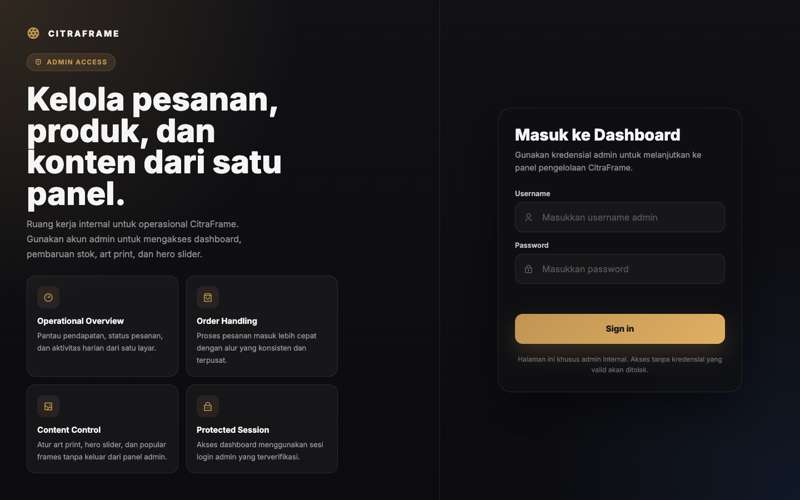{width=6.0in}

**Gambar 4.15 Pengelolaan Produk**

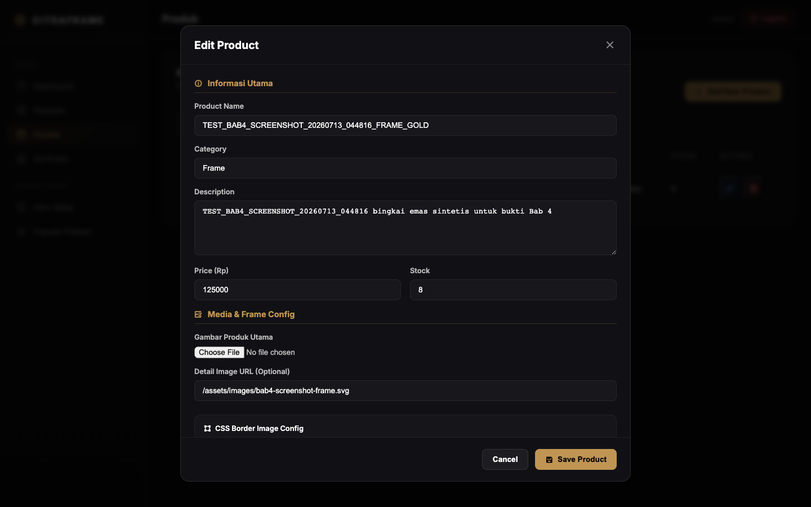{width=6.0in}

**Gambar 4.16 Pengelolaan Art Print**

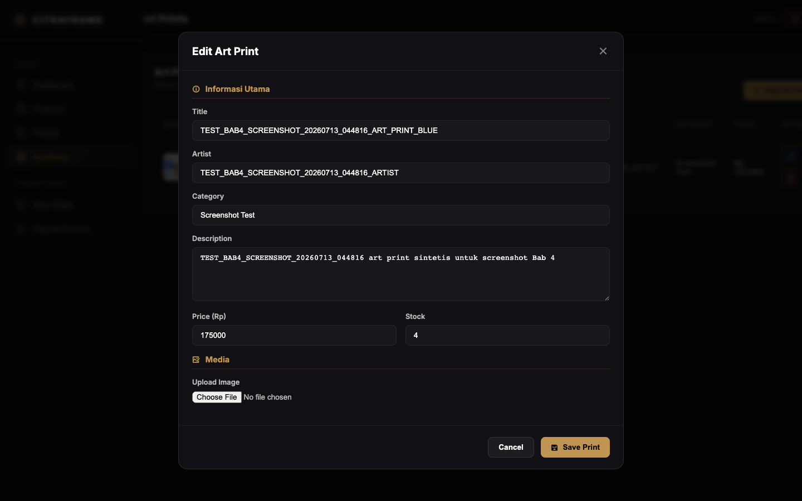{width=6.0in}

**Gambar 4.17 Pengelolaan Order**

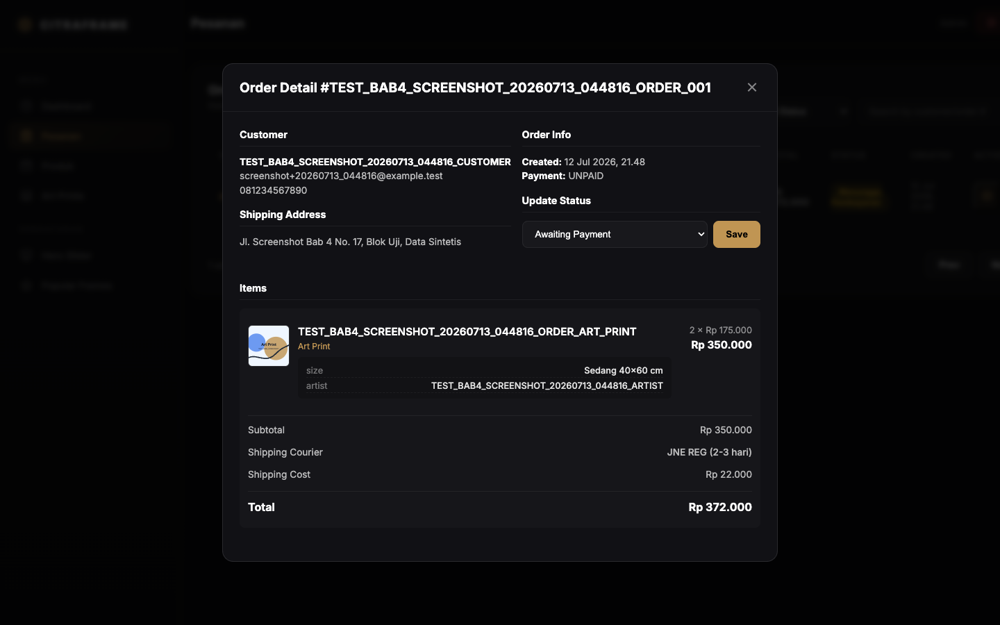{width=6.0in}

### 4.3.5 Implementasi Basis Data dan Migration

Migration repository dilengkapi untuk tabel yang digunakan sistem, yaitu `products`, `art_prints`, `orders`, `order_items`, `sliders`, `custom_orders`, `user_addresses`, dan `cart_items`. Migration juga menambahkan kolom dan indeks yang diperlukan secara aman tanpa menghapus tabel atau data. Pada database Aiven beta, migration menambahkan `orders.payment_url`, `orders.artwork_image_url`, serta beberapa indeks yang belum ada.

Pengujian migration pada database Aiven beta berhasil. Pengujian unit juga memverifikasi bahwa migration mendefinisikan tabel aktif yang dibutuhkan sistem. Namun, pembuatan database testing kosong terpisah belum dilakukan karena sesi ini diarahkan untuk memakai database Aiven beta yang sudah ada dan tidak membuat database Aiven baru.

### 4.3.6 Implementasi WebAR

Halaman WebAR dan aset `frame.glb` tersedia pada server lokal. File `frontend/assets/3d/frame.glb` berukuran 1.522.172 byte dan dapat diakses melalui HTTP dengan status 200. Pada pengujian network browser, request `frame.glb` ditemukan dengan `content-type` aktual `application/octet-stream`, ukuran response 1.522.172 bytes, dan tidak ada 404 pada asset utama. Referensi placeholder `path/to/your/frame-texture.jpg` tidak lagi ditemukan pada kode sehingga tidak menghasilkan 404 dari referensi runtime.

Pengujian WebAR yang membutuhkan kamera, WebXR, dan deteksi bidang pada perangkat *smartphone* belum dilakukan. Oleh karena itu, kemampuan menempatkan objek 3D secara *markerless* pada dinding, rotasi, translasi, dan penyesuaian posisi masih diberi status MEMERLUKAN SMARTPHONE.

**Gambar 4.18 Bukti Pemuatan Model GLB**

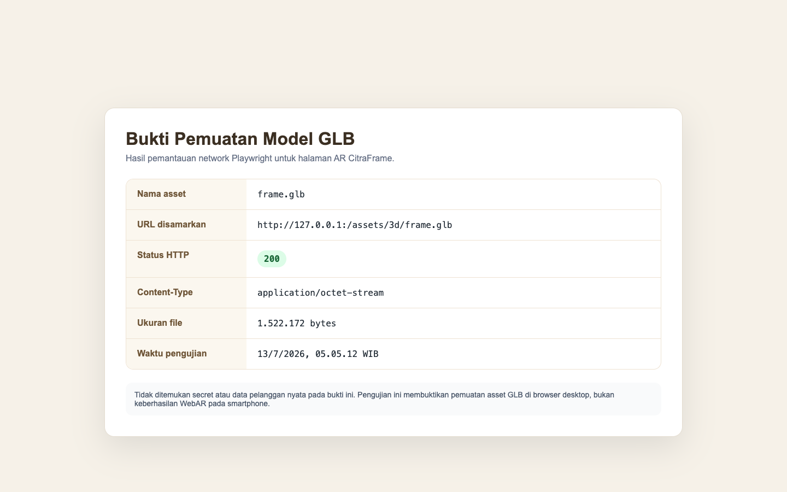{width=6.0in}

## 4.4 Pelaksanaan Pengujian

Pengujian dilakukan pada 13 Juli 2026 menggunakan environment beta. Secret pada `.env` digunakan oleh sistem dan test runner untuk koneksi, tetapi tidak dicatat dalam dokumen. Bukti visual pelanggan memakai data katalog nyata non-PII dari aplikasi beta. Pada halaman yang memuat identitas pelanggan atau order, dokumen menggunakan identitas uji netral dengan item katalog nyata agar tidak menampilkan data pelanggan nyata. Skenario otomatis yang membutuhkan operasi CREATE, UPDATE, dan DELETE tetap memakai data uji terkontrol sementara agar dapat dibersihkan tanpa menghapus data aplikasi.

**Tabel 4.6 Pelaksanaan Pengujian**

| No | Komponen | Keterangan |
|---|---|---|
| 1 | Waktu pengujian | 13 Juli 2026 |
| 2 | Lingkungan | Database Aiven beta yang digunakan proyek, *backend* lokal, dan *frontend static server* lokal |
| 3 | Data uji | Data katalog beta non-PII untuk bukti visual, serta data uji terkontrol sementara untuk skenario CREATE, UPDATE, DELETE, dan cleanup |
| 4 | Backend lokal | Berjalan pada port 8080 selama pengujian |
| 5 | Frontend lokal | Berjalan melalui *static server* lokal pada port 5173 selama pengujian |
| 6 | Jenis pengujian | Unit test mock, integration test Aiven, black box HTTP lokal, integrasi Firebase, Flip, Cloudinary, dan API.co.id |
| 7 | Batasan | Screenshot browser desktop tersedia; kamera WebAR smartphone belum diuji; SUS belum dilakukan; performa belum diukur |

Perintah pengujian utama yang berhasil dijalankan adalah `go test ./...`, `go build ./...`, `node --check` untuk seluruh JavaScript *frontend*, integration test Aiven dengan `BAB4_INTEGRATION=1`, serta black box HTTP lokal dengan `BAB4_BLACKBOX=1`.

## 4.5 Hasil Pengujian Black Box

Pengujian *black box* dilakukan dengan memeriksa keluaran sistem berdasarkan masukan tanpa menjadikan struktur internal kode sebagai bukti utama. Status PASS hanya diberikan ketika skenario benar-benar dijalankan dan hasil aktual sesuai dengan hasil yang diharapkan. Skenario yang membutuhkan perangkat *smartphone*, pengukuran performa, atau responden tidak dihitung sebagai keberhasilan.

**Tabel 4.7 Ringkasan Hasil Pengujian per Kelompok**

| Kelompok pengujian | PASS | FAIL | BELUM DIUJI | TIDAK BERLAKU | MEMERLUKAN SMARTPHONE | MEMERLUKAN RESPONDEN | Catatan |
|---|---:|---:|---:|---:|---:|---:|---|
| Unit test mock | 23 | 0 | 0 | 0 | 0 | 0 | Semua unit test prioritas PASS |
| Integration test Aiven | 18 | 0 | 1 | 0 | 0 | 0 | Database kosong terpisah belum diuji |
| Black box HTTP lokal | 29 | 0 | 2 | 0 | 0 | 0 | Login UI admin dan logout UI belum diuji |
| Firebase | 2 | 0 | 3 | 0 | 0 | 0 | Tidak ada akun Firebase uji nyata |
| Flip | 6 | 0 | 1 | 0 | 0 | 0 | Callback eksternal sandbox real belum diterima |
| Cloudinary | 4 | 0 | 0 | 0 | 0 | 0 | Upload dan cleanup data uji terkontrol berhasil |
| API.co.id | 2 | 0 | 0 | 0 | 0 | 0 | Ongkir reachable dan dipakai backend |
| WebAR/browser/performa/SUS | 6 | 0 | 1 | 0 | 2 | 1 | Screenshot browser desktop PASS; smartphone, performa, dan SUS masih perlu pengujian lanjutan |
| Frontend build | 0 | 0 | 0 | 1 | 0 | 0 | Tidak ada `package.json` karena frontend statis |

Persentase keberhasilan keseluruhan tidak dihitung karena beberapa kelompok berstatus BELUM DIUJI, TIDAK BERLAKU, MEMERLUKAN SMARTPHONE, atau MEMERLUKAN RESPONDEN. Jika hanya skenario yang benar-benar dijalankan dihitung, tidak ada skenario yang berstatus FAIL setelah perbaikan.

**Tabel 4.8 Hasil Pengujian Black Box Utama**

| ID | Modul | Skenario | Hasil aktual | Status | Bukti |
|---|---|---|---|---|---|
| BB-01 | Halaman publik | Homepage | 200 | PASS | `public_pages_and_assets` |
| BB-02 | Halaman publik | Katalog produk | 200 | PASS | `public_pages_and_assets` |
| BB-03 | Halaman publik | Art print | 200 | PASS | `public_pages_and_assets` |
| BB-04 | Halaman publik | Detail produk/art print | 200 | PASS | `public_pages_and_assets` |
| BB-05 | Halaman publik | Custom frame builder | 200 | PASS | `public_pages_and_assets` |
| BB-06 | Halaman publik | Halaman AR | 200 | PASS | `public_pages_and_assets` |
| BB-07 | Halaman publik | Login admin | 200 | PASS | `public_pages_and_assets` |
| BB-08 | Asset | JavaScript checkout | 200 | PASS | `public_pages_and_assets` |
| BB-09 | Asset | CSS utama | 200 | PASS | `public_pages_and_assets` |
| BB-10 | Asset | `frame.glb` | 200 dan file tidak kosong | PASS | `TestBAB4FrameGLBFileExists` |
| BB-11 | Asset | Placeholder texture | Referensi tidak ditemukan pada runtime | PASS | `rg` dan `frontend_asset_test` |
| BB-12 | Auth API | Stats tanpa JWT | 401 tanpa *redirect* | PASS | `api_auth_responses` |
| BB-13 | Auth API | Invoice/order tanpa auth | 401 tanpa *redirect* | PASS | `api_auth_responses` |
| BB-14 | Auth API | JWT invalid | 401 tanpa *redirect* | PASS | `api_auth_responses` |
| BB-15 | Admin login | Login gagal | 401 | PASS | `api_auth_responses` |
| BB-17 | Admin JWT | Stats dengan JWT | 200 | PASS | `admin_stats_with_JWT` |
| BB-18 | Admin produk | Create produk | 201 | PASS | `product_CRUD` |
| BB-19 | Admin produk | Update produk | 200 | PASS | `product_CRUD` |
| BB-20 | Admin produk | Delete produk | 204 | PASS | `product_CRUD` |
| BB-21 | Admin art print | Create art print | 201 | PASS | `art_print_CRUD` |
| BB-22 | Admin art print | Update art print | 200 | PASS | `art_print_CRUD` |
| BB-23 | Admin art print | Delete art print | 204 | PASS | `art_print_CRUD` |
| BB-24 | Admin slider | Create slider | 201 | PASS | `slider_CRUD` |
| BB-25 | Admin slider | Read slider admin | Slider uji terkontrol ditemukan | PASS | `slider_CRUD` |
| BB-26 | Admin slider | Delete slider | 200 | PASS | `slider_CRUD` |
| BB-27 | Custom order | Simpan custom frame | 201 | PASS | `custom_order_persistence` |
| BB-28 | Admin order | List order | 200 | PASS | `admin_order_list_detail_and_status_update` |
| BB-29 | Admin order | Detail order | 200 | PASS | `admin_order_list_detail_and_status_update` |
| BB-30 | Admin order | Update status | 200 dan status berubah | PASS | `admin_order_list_detail_and_status_update` |
| BB-16 | Admin login | Login UI berhasil | Tidak ada kredensial uji UI | BELUM DIUJI | Perlu akun admin uji |
| BB-31 | Admin logout | Logout UI | Tidak dijalankan pada sesi screenshot | BELUM DIUJI | Perlu skenario logout UI terpisah |

## 4.6 Hasil Pengujian Kinerja, Kompatibilitas, dan Usability

Pengujian kinerja belum menghasilkan nilai numerik karena sesi ini tidak menjalankan alat pengukuran performa khusus. Oleh karena itu, waktu muat halaman, penggunaan memori, dan *frame rate* WebAR belum dicatat. Status ini dicantumkan sebagai BELUM DIUJI, bukan PASS.

Pengujian kompatibilitas dasar melalui HTTP lokal dan browser desktop menunjukkan halaman publik, aset CSS, aset JavaScript, dan model GLB dapat diakses. Namun, kompatibilitas WebAR pada *smartphone* Android dengan dukungan ARCore serta browser yang mendukung WebXR belum diuji. Pengujian tersebut harus dilakukan menggunakan perangkat fisik karena memerlukan kamera dan izin sensor.

Pengujian *usability* dengan SUS belum dilakukan karena belum ada responden. Dengan demikian, nilai SUS, rata-rata skor, kategori penerimaan, dan interpretasi kepuasan pengguna belum dapat ditulis pada Bab IV. Bagian tersebut masih menjadi placeholder yang harus dilengkapi setelah kuesioner dikumpulkan.

**Tabel 4.9 Status Pengujian Non-Fungsional**

| ID | Jenis | Skenario | Hasil aktual | Status |
|---|---|---|---|---|
| PERF-01 | Kinerja | Loading time halaman | Belum diukur | BELUM DIUJI |
| PERF-02 | Kinerja WebAR | *Frame rate* WebAR | Belum diuji pada smartphone | MEMERLUKAN SMARTPHONE |
| COMP-01 | Kompatibilitas HTTP | Halaman dan aset lokal | 200 untuk halaman utama dan aset GLB | PASS |
| COMP-02 | Kompatibilitas WebXR | Kamera dan AR markerless | Belum diuji pada perangkat fisik | MEMERLUKAN SMARTPHONE |
| SUS-01 | Usability | Kuesioner SUS | Belum ada responden | MEMERLUKAN RESPONDEN |

## 4.7 Analisis dan Pembahasan Rumusan Masalah

Rumusan masalah pertama adalah bagaimana merancang sistem visualisasi produk berbasis WebAR yang dapat diakses melalui browser menggunakan WebXR dan Three.js tanpa instalasi aplikasi. Hasil implementasi menunjukkan bahwa sistem telah memiliki halaman AR berbasis web dan aset GLB yang dapat dimuat melalui HTTP lokal. Hal ini membuktikan kesiapan komponen web dan aset 3D. Namun, keberhasilan penuh rumusan masalah pertama belum dapat dinyatakan final karena uji pada browser *smartphone* dengan WebXR dan kamera belum dilakukan.

Rumusan masalah kedua adalah bagaimana menerapkan *markerless AR* dengan deteksi bidang atau *surface detection* untuk menempatkan objek 3D secara proporsional pada permukaan dinding. Dari sisi implementasi, sistem menyediakan aset 3D dan halaman AR. Akan tetapi, deteksi bidang, kestabilan penempatan objek, dan kesesuaian proporsi di dinding harus dibuktikan melalui perangkat fisik. Oleh karena itu, pembahasan rumusan masalah kedua masih bersifat parsial dan membutuhkan pengujian lanjutan pada *smartphone*.

Rumusan masalah ketiga adalah bagaimana mengimplementasikan interaksi pengguna berupa rotasi, translasi, dan penyesuaian posisi agar objek 3D mudah dan stabil ditempatkan. Pada sesi otomatis, mode pemilihan AR dan pemuatan model GLB telah dibuktikan melalui browser desktop. Namun, interaksi kamera, deteksi bidang, rotasi, translasi, dan kestabilan penempatan objek masih memerlukan pengujian langsung pada perangkat *smartphone*.

Di luar aspek WebAR, hasil pengujian menunjukkan bahwa sistem pendukung transaksi telah meningkat secara signifikan. Validasi *checkout*, otorisasi order, proteksi admin, integrasi Cloudinary, API.co.id, Flip *sandbox*, dan pembersihan data uji terkontrol telah berjalan. Ini penting karena sistem visualisasi produk tidak berdiri sendiri, melainkan terhubung dengan proses pemesanan dan administrasi CitraFrame.

## 4.8 Ringkasan Bab

Berdasarkan pengujian pada environment beta, fitur yang terbukti berhasil adalah akses halaman publik utama, akses aset `frame.glb`, proteksi endpoint admin, proteksi detail order, respons JSON 401/403 tanpa *redirect* 302, validasi *checkout*, perhitungan ulang harga dan ongkir di *backend*, pembuatan payment link Flip *sandbox*, kompensasi stok saat Flip gagal, CRUD produk, CRUD *art print*, CRUD slider, daftar/detail/update order admin, upload dan cleanup Cloudinary, serta akses ongkir API.co.id.

Tidak ada skenario yang tetap berstatus FAIL setelah perbaikan. Bug yang ditemukan selama pengujian adalah respons Flip *sandbox* dengan `link_id` numeric, payment URL Flip tanpa skema URL, serta schema beta yang belum memiliki beberapa kolom dan indeks. Ketiga bug tersebut telah diperbaiki dan diuji ulang hingga PASS.

Bukti visual Bab IV menggunakan data katalog nyata non-PII pada aplikasi beta, antara lain Arcalod Gold, Arcalod Silver, Araclodd, Golden Eagle Sovereign, Golden Bull Power, Black Panther Royale, dan Violet Run of Freedom. Data uji terkontrol sementara dibuat hanya untuk skenario otomatis yang membutuhkan CREATE, UPDATE, DELETE, transaksi pembayaran, dan cleanup. Setelah pengujian, data uji sementara tersebut dibersihkan dan verifikasi cleanup menyatakan tidak ada sisa row pada tabel yang diuji untuk sesi utama dan sesi screenshot.

Screenshot otomatis berhasil dibuat untuk 18 bukti visual, yaitu halaman beranda, katalog produk, katalog *art print*, detail produk, *custom frame builder*, keranjang, alamat, *checkout*, validasi *checkout*, bukti payment link Flip *sandbox*, invoice, pemilihan mode AR, login admin, dashboard admin, pengelolaan produk, pengelolaan *art print*, pengelolaan order, dan bukti pemuatan GLB.

Pengujian yang masih harus dilakukan menggunakan *smartphone* adalah WebAR dengan kamera, deteksi bidang, penempatan objek pada dinding, rotasi, translasi, penyesuaian skala/posisi, dan pengukuran *frame rate*. Data SUS juga masih harus dikumpulkan dari responden sebelum bagian *usability* dapat disimpulkan.

Bagian Bab IV yang sudah dapat dianggap kuat adalah spesifikasi sistem beta, hasil implementasi *backend*, hasil pengujian otorisasi, hasil pengujian *checkout*, hasil integrasi Flip *sandbox*, Cloudinary, API.co.id, hasil black box HTTP lokal, dan bukti screenshot browser desktop. Bagian yang masih placeholder adalah pengujian WebAR pada *smartphone*, pengujian performa, dan analisis SUS.
