# 3.9 Perancangan Antarmuka Pengguna dan Pengalaman Pengguna (UI/UX)

Perancangan *User Interface* (UI) dan *User Experience* (UX) pada website CitraFrame disusun untuk mendukung rangkaian aktivitas pelanggan mulai dari mencari produk, membuat bingkai khusus, melakukan visualisasi menggunakan *Augmented Reality* (AR), mengelola keranjang, menyelesaikan transaksi, hingga memantau pesanan. Antarmuka yang dibahas pada bagian ini merupakan rancangan fidelitas tinggi yang telah disesuaikan dengan implementasi website CitraFrame saat ini. Dengan demikian, rancangan tidak hanya menunjukkan tampilan visual, tetapi juga menggambarkan keadaan antarmuka, umpan balik sistem, dan perpindahan pengguna di setiap proses utama.

Pendekatan visual CitraFrame menggunakan tampilan minimalis dengan dominasi warna putih, hitam, abu-abu muda, serta aksen emas yang merepresentasikan karakter kayu dan produk bingkai. Struktur halaman menggunakan ruang kosong yang cukup, kartu produk, tombol aksi yang konsisten, dan hierarki tipografi yang jelas. Pada perangkat desktop, konten ditampilkan dalam beberapa kolom untuk memanfaatkan ruang layar. Pada fitur AR, antarmuka disesuaikan untuk layar telepon genggam dan menggunakan panel transparan gelap agar informasi tetap terbaca di atas tampilan kamera.

## 3.9.1 Tujuan dan Prinsip Perancangan

Perancangan UI/UX CitraFrame mempunyai beberapa tujuan utama sebagai berikut.

1. **Memudahkan eksplorasi produk.** Pengguna dapat berpindah di antara pilihan bingkai, *art print*, katalog produk, dan pembuatan bingkai khusus melalui navigasi utama yang konsisten.
2. **Memberikan representasi produk yang jelas.** Gambar berukuran besar, nama produk, kategori, harga, ukuran, dan hasil konfigurasi ditempatkan berdekatan agar pengguna dapat membandingkan pilihan tanpa kehilangan konteks.
3. **Menjaga kontinuitas alur transaksi.** Informasi item, jumlah, alamat, ekspedisi, ongkos kirim, dan total pembayaran ditampilkan bertahap sehingga pengguna memahami konsekuensi setiap tindakan sebelum melanjutkan.
4. **Memberikan umpan balik status.** Kondisi aktif, tidak aktif, berhasil, peringatan, stok tidak tersedia, dan status pesanan dibedakan menggunakan teks, warna, ikon, serta keadaan tombol.
5. **Mendukung visualisasi markerless AR.** Antarmuka AR memberikan instruksi pemindaian, indikator kestabilan bidang, tombol penempatan, kontrol setelah objek ditempatkan, serta opsi penempatan manual ketika bidang dinding sulit dideteksi.
6. **Menyesuaikan antarmuka dengan perangkat.** Halaman utama dan transaksi dirancang untuk layar desktop maupun perangkat bergerak, sedangkan kontrol AR menggunakan ukuran tombol dan posisi elemen yang mudah dijangkau dengan sentuhan.

Prinsip yang digunakan adalah konsistensi, visibilitas status sistem, pencegahan kesalahan, pengenalan dibandingkan mengingat, dan kontrol pengguna. Konsistensi diwujudkan melalui navbar, kartu, tombol emas sebagai aksi utama, serta tata letak dua kolom pada halaman yang membutuhkan perbandingan. Visibilitas status diterapkan melalui jumlah item keranjang, status pesanan, status kestabilan dinding, reticle, dan perubahan tombol. Pencegahan kesalahan diterapkan dengan menonaktifkan tombol ketika persyaratan belum lengkap, menyediakan konfirmasi, dan menampilkan pesan ketika bidang atau stok belum tersedia.

## 3.9.2 Sistem Visual Antarmuka

Sistem visual digunakan agar setiap halaman tetap memiliki identitas dan pola interaksi yang sama. Rincian elemen visual utama ditunjukkan pada Tabel 3.9.

**Tabel 3.9 Sistem visual antarmuka CitraFrame**

| Elemen | Rancangan | Fungsi UX |
|---|---|---|
| Warna utama | Emas kayu `#C09553`, dengan variasi `#B88E5D` pada halaman akun dan checkout | Menandai tombol utama, harga, elemen terpilih, dan identitas merek |
| Warna teks | Hitam `#1A1A1A` dan abu-abu `#333333`/`#666666` | Membentuk hierarki informasi utama dan sekunder |
| Latar | Putih `#FFFFFF`, putih hangat `#FDFDFD`, dan abu-abu terang `#F8F9FA` | Mempertahankan fokus pada produk dan mengurangi kepadatan visual |
| Tipografi | Inter atau Noto Sans pada antarmuka; ukuran dan ketebalan dibedakan menurut tingkat informasi | Menjaga keterbacaan pada desktop dan perangkat bergerak |
| Tombol utama | Latar emas, teks kontras, sudut membulat, serta perubahan visual saat aktif atau tidak aktif | Menunjukkan aksi yang direkomendasikan pada setiap tahap |
| Kartu | Latar putih, sudut membulat, batas atau bayangan ringan | Mengelompokkan produk, ringkasan, alamat, pesanan, dan layanan |
| Ikon | Ikon garis sederhana untuk keranjang, akun, unggah, mata/AR, hapus, edit, dan navigasi | Mempercepat pengenalan fungsi tanpa menggantikan label teks |
| Warna semantik | Hijau untuk berhasil/stabil, kuning-emas untuk perhatian, merah untuk kesalahan, dan abu-abu untuk tidak aktif | Memperkuat status sistem selain melalui teks |

Navbar pada halaman publik berisi logo CitraFrame, menu Pilihan Frame, Art Prints, Produk, dan Testimoni. Bagian kanan navbar menampilkan keranjang, akun pelanggan, tombol “Lihat Bingkai di Dindingmu”, serta tombol “Buat Bingkai Custom”. Tombol AR diberi aksen paling kuat karena menjadi fitur pembeda utama sistem. Navbar tetap berada di bagian atas agar fungsi penting dapat ditemukan secara konsisten ketika pengguna berpindah halaman.

## 3.9.3 Halaman Beranda dan Eksplorasi Produk

Halaman beranda berfungsi sebagai titik awal eksplorasi. Bagian *hero* menampilkan contoh bingkai dan karya pada ruang interior sehingga pengguna memperoleh gambaran penggunaan produk. Tombol panah dan indikator *slide* memberi kontrol terhadap konten promosi. Di bagian navbar, jumlah item keranjang ditampilkan sebagai lencana sehingga status keranjang dapat diketahui tanpa membuka halaman lain.

{width=6.10in}

::: {custom-style="Image Caption"}
**Gambar 3.9 Rancangan halaman beranda CitraFrame**
:::

Galeri *art print* menggunakan susunan kartu yang konsisten. Setiap kartu menyajikan pratinjau karya, judul, seniman, dan harga. Filter artis dan kategori ditempatkan sebelum daftar untuk mempersempit pilihan. Struktur ini mengurangi jumlah langkah saat pengguna mencari tema atau seniman tertentu.

{width=6.10in}

::: {custom-style="Image Caption"}
**Gambar 3.10 Rancangan halaman galeri Art Prints**
:::

Halaman katalog produk menampilkan bingkai dan produk non-*art print*. Filter kategori diletakkan di bagian atas, sedangkan kartu memuat foto, nama, material, dan harga. Penggunaan ruang putih dan bayangan ringan membantu pengguna membedakan setiap item tanpa batas visual yang berlebihan.

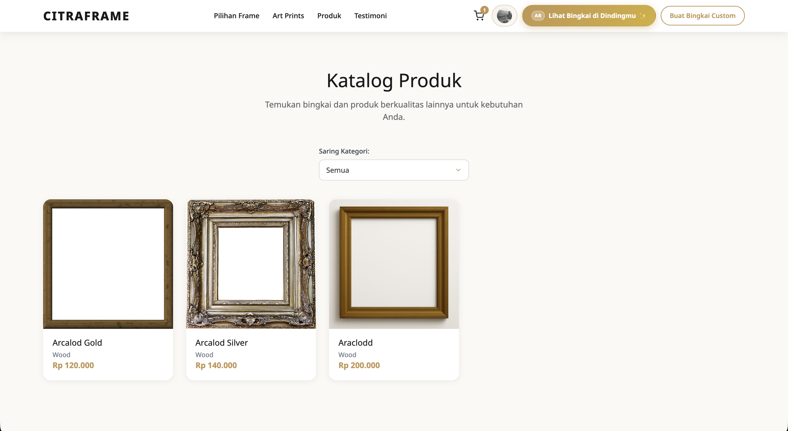{width=6.10in}

::: {custom-style="Image Caption"}
**Gambar 3.11 Rancangan halaman katalog produk**
:::

Bagian pilihan frame populer mengutamakan perbandingan visual antarmodel. Gambar ditampilkan lebih besar daripada teks karena bentuk profil dan ornamen bingkai merupakan informasi utama. Tombol “Lihat Semua Pilihan” menghubungkan bagian promosi dengan katalog lengkap.

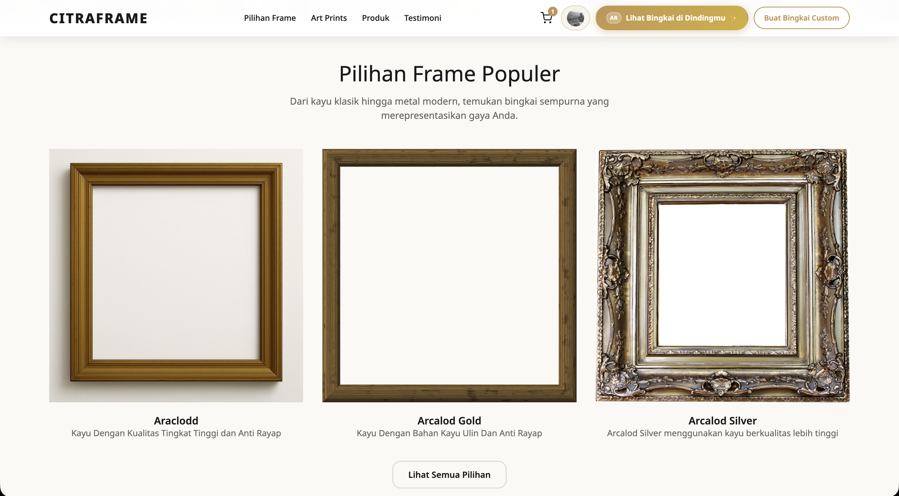{width=6.10in}

::: {custom-style="Image Caption"}
**Gambar 3.12 Rancangan bagian pilihan frame populer**
:::

```{=openxml}
<w:p><w:r><w:br w:type="page"/></w:r></w:p>
```

## 3.9.4 Informasi Layanan dan Ajakan Menggunakan AR

Bagian promosi AR menggunakan pola dua kolom. Kolom kiri menjelaskan manfaat, kemampuan utama, dan tombol “Coba AR Sekarang”, sedangkan kolom kanan menampilkan ilustrasi penempatan objek pada ruang. Struktur ini menghubungkan penjelasan konseptual dengan contoh visual sehingga pengguna mengetahui hasil yang diharapkan sebelum memberikan izin kamera.

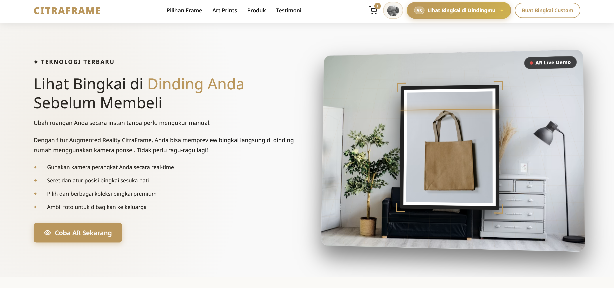{width=6.10in}

::: {custom-style="Image Caption"}
**Gambar 3.13 Rancangan bagian promosi visualisasi AR**
:::

Bagian “Kenapa Memilih CitraFrame?” menyajikan alasan utama dalam bentuk daftar berikon, yaitu kualitas premium, pengerjaan cepat, dan kepuasan pelanggan. Gambar pendukung ditempatkan pada sisi kanan agar halaman tidak didominasi teks.

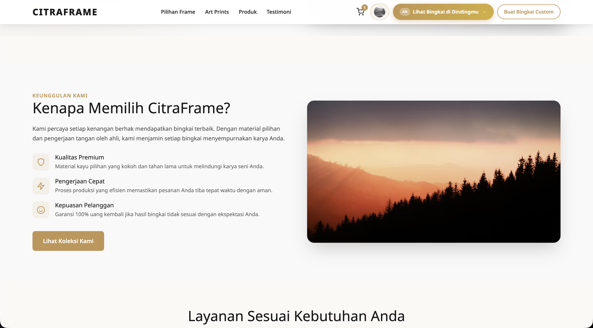{width=6.10in}

::: {custom-style="Image Caption"}
**Gambar 3.14 Rancangan bagian keunggulan CitraFrame**
:::

```{=openxml}
<w:p><w:r><w:br w:type="page"/></w:r></w:p>
```

Pengguna dapat memilih dua jalur layanan, yaitu “Hanya Bingkai” dan “Visualisasi AR”. Pemisahan ini mencegah pengguna harus memahami seluruh fitur sebelum melakukan tindakan. Setiap kartu memiliki deskripsi singkat dan satu tombol aksi yang menjelaskan langkah berikutnya.

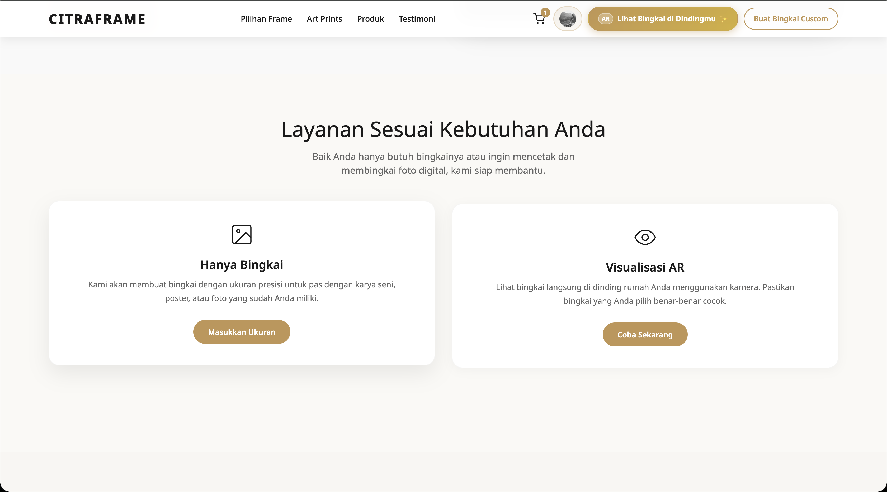{width=6.10in}

::: {custom-style="Image Caption"}
**Gambar 3.15 Rancangan pemilihan layanan CitraFrame**
:::

Bagian testimoni memberikan bukti sosial melalui penilaian, kutipan, nama, dan lokasi pelanggan. Footer mengelompokkan navigasi, bantuan, dan media sosial. Penempatan footer berwarna gelap menandai akhir halaman sekaligus memberikan akses ulang ke tautan penting.

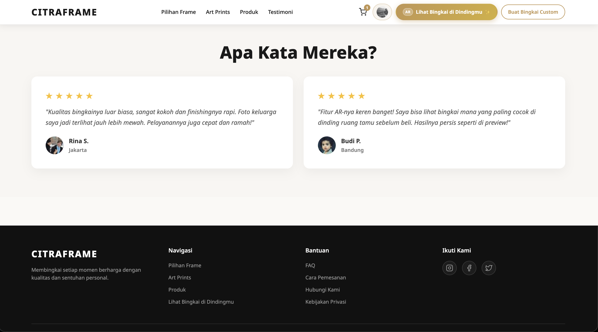{width=6.10in}

::: {custom-style="Image Caption"}
**Gambar 3.16 Rancangan testimoni dan footer**
:::

```{=openxml}
<w:p><w:r><w:br w:type="page"/></w:r></w:p>
```

## 3.9.5 Halaman Custom Frame Builder

Halaman *Custom Frame Builder* menggunakan tata letak dua kolom untuk mempertahankan hubungan antara pilihan dan hasil. Kolom kiri menampilkan pratinjau bingkai serta input ukuran karya dan unggahan gambar. Kolom kanan memuat langkah konfigurasi berupa pemilihan model frame, lebar dan warna *matboard*, serta pelindung kaca. Perubahan pilihan dirancang untuk langsung tercermin pada pratinjau sehingga pengguna tidak perlu berpindah halaman.

Tombol “Lihat Bingkai di Dindingmu” ditempatkan setelah pratinjau dan ukuran karena visualisasi AR harus menggunakan konfigurasi yang sedang aktif. Urutan ini menjaga konsistensi data antara hasil konfigurasi, model yang divisualisasikan, dan item yang dimasukkan ke keranjang.

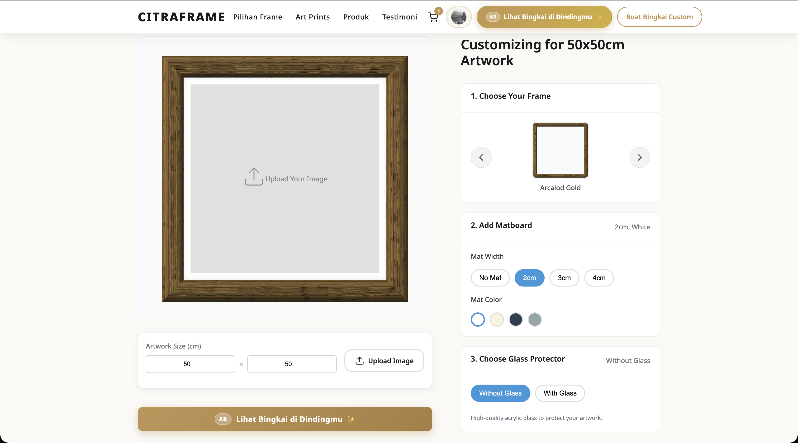{width=6.10in}

::: {custom-style="Image Caption"}
**Gambar 3.17 Rancangan halaman Custom Frame Builder**
:::

## 3.9.6 Keranjang dan Checkout

Halaman keranjang memisahkan daftar item dan ringkasan belanja. Pengguna dapat memilih sebagian item untuk diproses, mengubah jumlah, atau menghapus item. Item yang dipilih diberi penanda visual, sementara ringkasan menampilkan jenis item, jumlah yang diproses, dan total. Dengan pola ini, pengguna tetap dapat menyimpan beberapa item di keranjang tanpa harus membayar semuanya dalam satu transaksi.

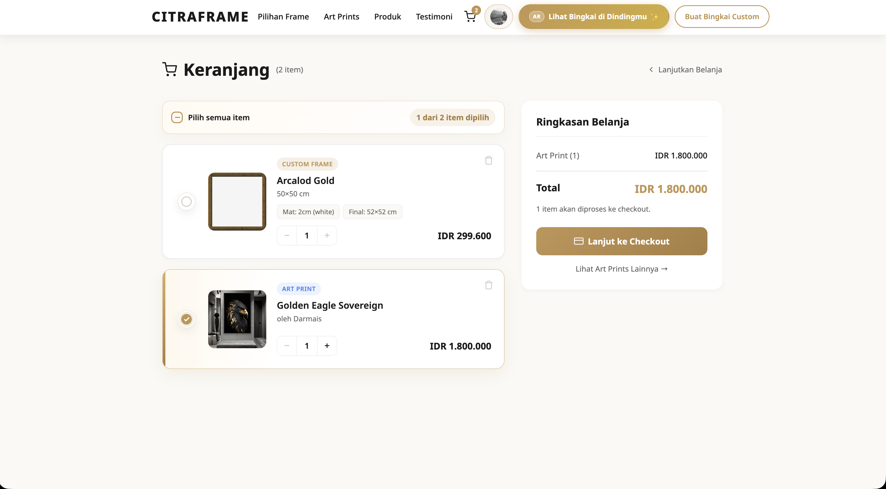{width=6.10in}

::: {custom-style="Image Caption"}
**Gambar 3.18 Rancangan halaman keranjang**
:::

```{=openxml}
<w:p><w:r><w:br w:type="page"/></w:r></w:p>
```

Halaman *checkout* menyusun informasi dalam kelompok alamat pengiriman, produk dipesan, opsi pengiriman, dan ringkasan pembayaran. Opsi ekspedisi menggunakan komponen *radio button* agar hanya satu layanan dapat dipilih. Harga ongkos kirim, estimasi, dan berat ditampilkan dalam kartu yang sama sehingga pilihan dapat dibandingkan secara langsung. Tombol pembayaran berada pada ringkasan dan hanya dapat digunakan setelah persyaratan alamat, ekspedisi, dan metode pembayaran terpenuhi.

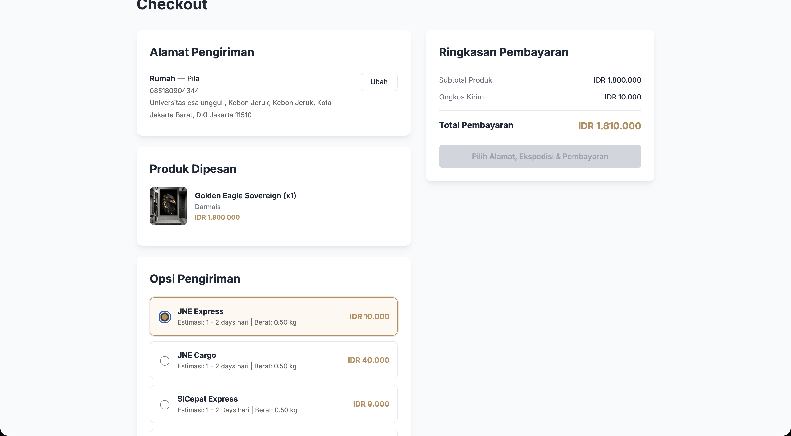{width=6.10in}

::: {custom-style="Image Caption"}
**Gambar 3.19 Rancangan halaman checkout**
:::

Alur UX transaksi yang dirancang adalah: pengguna memilih item, menekan “Lanjut ke Checkout”, memeriksa alamat, memilih ekspedisi, memeriksa subtotal dan ongkir, memilih metode pembayaran, lalu menekan tombol bayar. Pada kegagalan validasi, sistem mempertahankan pengguna pada tahap terkait dan memberikan pesan agar data dapat diperbaiki tanpa mengulang proses dari awal.

## 3.9.7 Halaman Akun Pelanggan

Halaman akun menggunakan sidebar yang konsisten untuk berpindah antara riwayat pesanan dan buku alamat. Informasi identitas ditampilkan secara ringkas agar area utama tetap digunakan untuk aktivitas pelanggan. Pada riwayat pesanan, tab status membantu penyaringan, sedangkan setiap kartu pesanan menampilkan nomor, tanggal, item, total, status, dan tombol “Detail & Invoice”.

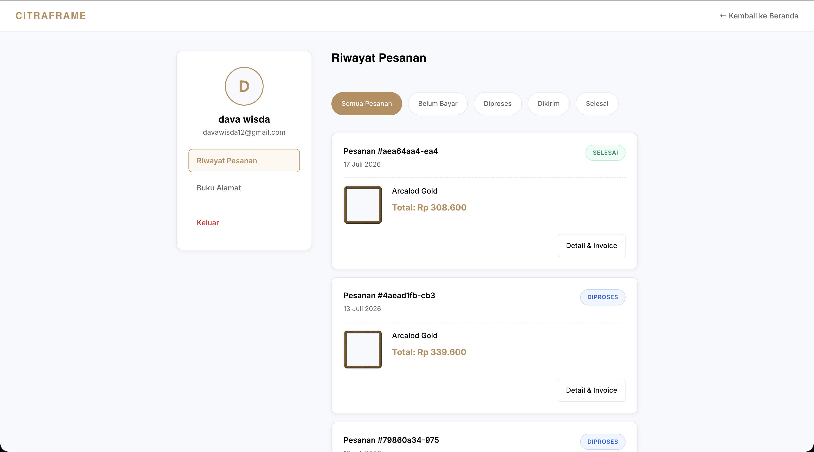{width=6.10in}

::: {custom-style="Image Caption"}
**Gambar 3.20 Rancangan halaman riwayat pesanan**
:::

```{=openxml}
<w:p><w:r><w:br w:type="page"/></w:r></w:p>
```

Halaman buku alamat menampilkan alamat dalam bentuk kartu lengkap dengan label, penerima, nomor telepon, alamat administratif, kode pos, serta tindakan ubah dan hapus. Tombol “Tambah Alamat” ditempatkan dekat judul halaman agar mudah ditemukan. Alamat disimpan pada akun dan digunakan kembali ketika pengguna melakukan *checkout*, sehingga pengisian berulang dapat dikurangi.

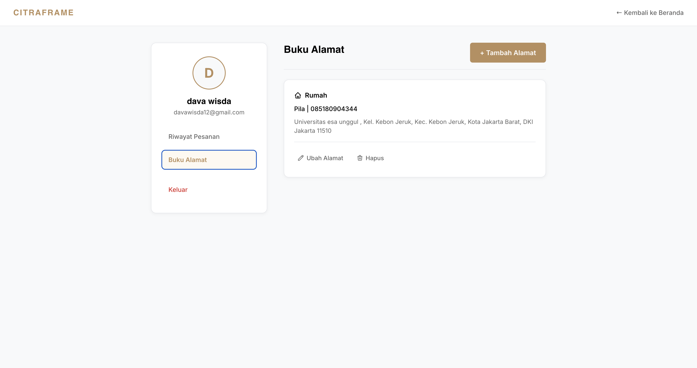{width=6.10in}

::: {custom-style="Image Caption"}
**Gambar 3.21 Rancangan halaman buku alamat**
:::

## 3.9.8 Antarmuka Visualisasi Augmented Reality

Antarmuka AR dirancang sebagai tampilan layar penuh di atas kamera. Informasi yang dipertahankan selama sesi adalah tombol keluar, ukuran frame, instruksi status, tombol “Tempatkan Manual”, panel panduan, tombol penempatan, dan tombol foto. Informasi tersebut ditempatkan pada bagian atas dan bawah layar agar area tengah tetap dapat digunakan untuk membidik dinding.

Proses interaksi AR terdiri atas empat keadaan utama: pemindaian bidang, bidang stabil, objek terpasang, dan penempatan manual. Perubahan keadaan selalu disertai teks dan perubahan kontrol, sehingga pengguna tidak hanya bergantung pada warna.

| Keadaan | Umpan balik antarmuka | Tindakan pengguna |
|---|---|---|
| Pemindaian | Pesan bahwa dinding polos lebih sulit dipindai, panel panduan, serta tombol “Tempel Bingkai” belum aktif | Mengarahkan kamera ke tepi dinding, bayangan, atau pertemuan dinding dan lantai |
| Bidang stabil | Reticle berwarna hijau, label “Dinding stabil”, dan tombol “Tempel Bingkai” aktif | Mengarahkan reticle ke posisi yang diinginkan dan menempelkan bingkai |
| Objek terpasang | Model bingkai tetap berada pada posisi hasil *hit-test*; tersedia hapus, rotasi, dan foto | Mengamati hasil dari sudut berbeda, merotasi, memotret, atau menghapus objek |
| Penempatan manual | Model mengikuti perkiraan posisi dan panel pengaturan jarak, tinggi, kiri/kanan, sudut dinding, serta kemiringan | Menyesuaikan parameter, memindai ulang, atau mengonfirmasi posisi perkiraan |

```{=openxml}
<w:p><w:r><w:br w:type="page"/></w:r></w:p>
```

### a. Keadaan Pemindaian dan Bidang Stabil

Pada awal sesi, sistem memberikan panduan ketika dinding polos belum menghasilkan *hit-test* yang stabil. Instruksi menganjurkan pengguna mengarahkan kamera ke bagian yang mempunyai ciri visual, seperti tepi dinding, sambungan permukaan, atau bayangan. Tombol penempatan dinonaktifkan sampai sistem memperoleh bidang yang memadai. Setelah stabil, reticle berubah menjadi hijau, status menjadi “Dinding stabil”, dan tombol penempatan diaktifkan.

| Pemindaian bidang | Bidang stabil |
|:--:|:--:|
| 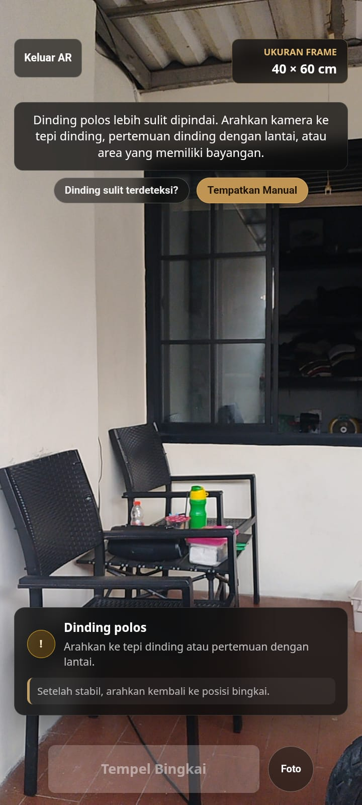{width=2.65in} | 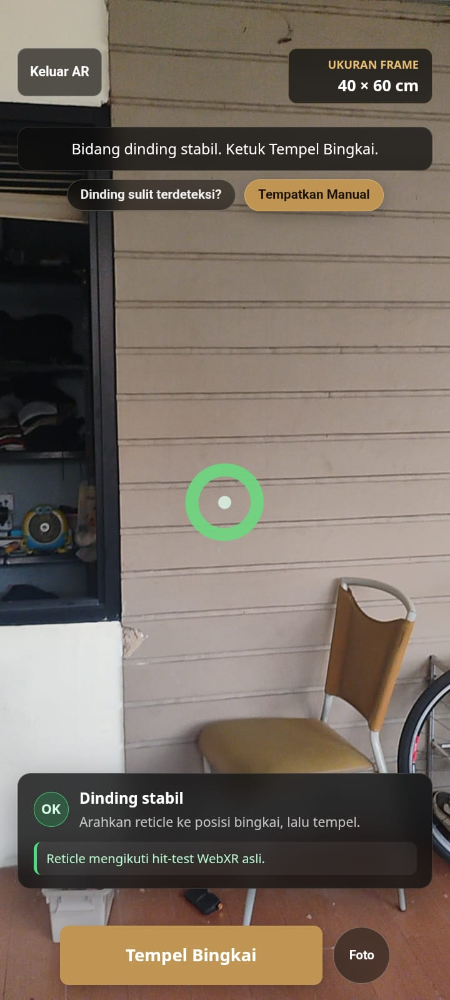{width=2.65in} |

::: {custom-style="Image Caption"}
**Gambar 3.22 Rancangan keadaan pemindaian dan bidang stabil pada WebAR**
:::

```{=openxml}
<w:p><w:r><w:br w:type="page"/></w:r></w:p>
```

### b. Keadaan Objek Terpasang dan Penempatan Manual

Setelah pengguna menekan tombol “Tempel Bingkai”, objek 3D ditempatkan berdasarkan pose hasil *hit-test*. Kontrol bawah berubah menjadi tombol hapus, rotasi, dan foto. Keadaan ini mempertahankan hubungan objek dengan ruang AR sehingga pengguna dapat menggerakkan kamera untuk melihat hasil dari posisi berbeda.

Penempatan manual disediakan sebagai jalur alternatif apabila deteksi bidang sulit digunakan. Pada mode ini, sistem secara eksplisit menampilkan keterangan bahwa posisi merupakan perkiraan dan bukan hasil deteksi bidang. Panel kontrol menyediakan pengaturan jarak, tinggi, posisi horizontal, sudut dinding, dan kemiringan. Tombol “Pindai lagi” mengembalikan pengguna ke proses deteksi, sedangkan “Konfirmasi” menerima parameter manual.

| Bingkai terpasang | Penempatan manual |
|:--:|:--:|
| 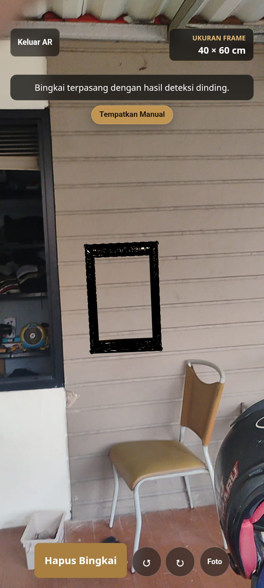{width=2.65in} | 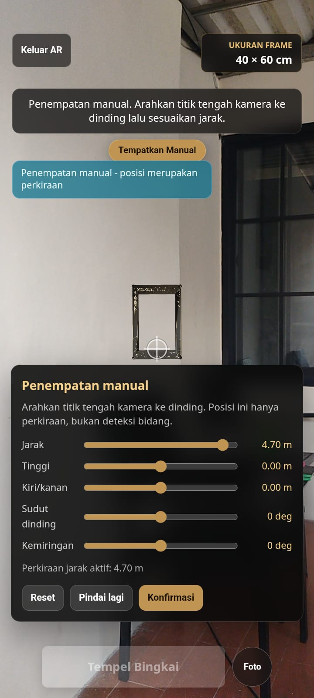{width=2.65in} |

::: {custom-style="Image Caption"}
**Gambar 3.23 Rancangan keadaan objek terpasang dan penempatan manual**
:::

Mode manual tidak diposisikan sebagai pengganti akurasi *hit-test* WebXR. Label “posisi merupakan perkiraan” dipertahankan untuk mencegah pengguna menyimpulkan bahwa posisi manual memiliki ketepatan spasial yang sama dengan penempatan berbasis bidang. Meskipun demikian, mode tersebut tetap mendukung visualisasi proporsi dan orientasi frame ketika kondisi dinding, pencahayaan, atau kemampuan perangkat menghambat deteksi.

## 3.9.9 Alur Pengalaman Pengguna

Alur pengalaman pengguna pada CitraFrame dirancang sebagai berikut.

1. Pengguna membuka beranda dan memilih jalur berupa katalog frame, *art print*, produk, pembuatan frame khusus, atau visualisasi AR.
2. Pengguna melihat detail produk atau mengatur konfigurasi frame, kemudian dapat membuka visualisasi AR untuk melihat perkiraan kecocokan pada dinding.
3. Setelah memperoleh pilihan, pengguna menambahkan item ke keranjang. Sistem menampilkan item, jumlah, harga, dan status pemilihan.
4. Ketika melanjutkan ke *checkout*, sistem memeriksa autentikasi, alamat, item, ekspedisi, dan total pembayaran.
5. Pengguna menyelesaikan pembayaran melalui layanan pembayaran yang disediakan, kemudian memantau status melalui halaman riwayat pesanan dan membuka invoice.
6. Untuk transaksi berikutnya, pengguna dapat menggunakan alamat yang telah tersimpan pada buku alamat.

Rancangan tersebut memisahkan aktivitas eksplorasi dan transaksi, tetapi tetap mempertahankan jalur yang singkat di antara keduanya. Fitur publik dan visualisasi dapat dijelajahi terlebih dahulu, sedangkan autentikasi diperlukan ketika data pelanggan harus disimpan atau transaksi dilanjutkan. Dengan demikian, pengguna tidak dibebani proses login sebelum memahami produk dan manfaat fitur AR.

## 3.9.10 Ringkasan Perancangan UI/UX

Perancangan UI/UX CitraFrame mengintegrasikan antarmuka katalog, konfigurasi frame, markerless WebAR, transaksi, dan akun pelanggan dalam satu pola visual. Aksen emas membangun identitas produk bingkai, sementara kartu dan tata letak bertahap membantu pengelompokan informasi. Pada fitur AR, rancangan memberi prioritas pada visibilitas status melalui instruksi, reticle, keadaan tombol, dan panel panduan. Tersedianya penempatan manual memberikan jalur alternatif ketika dinding sulit dideteksi, dengan batasan akurasi yang dijelaskan langsung pada antarmuka. Keseluruhan rancangan diarahkan agar pengguna dapat memahami posisi proses, tindakan yang tersedia, serta hasil setiap tindakan tanpa harus mempelajari cara kerja teknis sistem terlebih dahulu.
